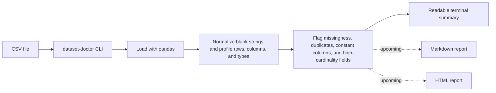

# Dataset Doctor

Turn messy CSV files into an instant data health report.

Dataset Doctor is an open-source Python CLI for fast first-pass dataset checks. Point it at a CSV file and it will profile dataset shape, missingness, duplicate rows, semantic column types, uniqueness patterns, constant columns, and high-cardinality fields so you can spot risky columns before deeper cleaning or modeling work begins.

## Why this project exists

Many CSV files look usable until hidden issues derail the workflow: sparse columns, accidental duplicates, ID-like fields masquerading as categories, or columns that carry no information at all. Dataset Doctor is meant to surface those problems in seconds with a small, readable command-line interface.

## Current milestone: Days 1-5

This repository currently focuses on the first five days of the roadmap:

- Project bootstrap with packaging, licensing, and tests
- CSV loading through a Python CLI
- Dataset overview and terminal summary output
- Missing-value and duplicate-row checks
- Semantic column typing, uniqueness, constant-column, and high-cardinality detection
- Better day 1-5 ergonomics such as whitespace-only missing-value normalization and a clearer health snapshot

HTML and Markdown report generation are still planned next and are intentionally not presented as finished features yet.

## What the CLI checks today

- Row count and column count
- Column names
- Per-column missing count and missing percentage
- Duplicate row count and duplicate percentage
- Semantic column types: `numeric`, `boolean`, `datetime`, `categorical`
- Per-column unique count and unique ratio
- Constant columns
- High-cardinality string columns
- A suspicious-columns summary for fast triage
- A type breakdown and health snapshot for quick reading

## Quickstart

```bash
python -m venv .venv
```

Windows:

```bash
.venv\Scripts\activate
```

macOS / Linux:

```bash
source .venv/bin/activate
```

Install and run:

```bash
pip install -e .[dev]
dataset-doctor data/demo/quotes_to_scrape_doctor_demo.csv
```

If you prefer module execution during development:

```bash
python -m dataset_doctor.cli data/demo/quotes_to_scrape_doctor_demo.csv
```

## Usage

```bash
dataset-doctor PATH_TO_FILE.csv --separator "," --encoding "utf-8"
```

## Example output

```text
Dataset Doctor
==============

Overview
  Source: quotes_to_scrape_doctor_demo.csv
  Rows: 11
  Columns: 7
  Duplicate rows: 1

Health Snapshot
  High-missing columns (>30%): 1
  Constant columns: 1
  High-cardinality columns: 3
  Suspicious columns: 4

Type Summary
  - categorical: 5
  - numeric: 1
  - boolean: 0
  - datetime: 1

Missingness (sorted)
  - primary_tag: 4 missing (36.4%) HIGH
  - author: 1 missing (9.1%)
  - tag_count: 1 missing (9.1%)

Suspicious Columns
  - primary_tag: 36.4% missing; high-cardinality strings
  - quote_id: high-cardinality strings
  - quote_text: high-cardinality strings
  - source_site: constant values only
```

## Demo data

The repository now includes demo data under `data/` instead of `examples/`.

- `data/raw/quotes_to_scrape_page_1.csv` is based on page 1 of [Quotes to Scrape](https://quotes.toscrape.com/), a public practice site for scraping.
- `data/demo/quotes_to_scrape_doctor_demo.csv` is a small derived dataset built from that scraped source and intentionally left with a few quality issues so the day 1-5 checks have something meaningful to detect.

More detail is documented in [data/README.md](data/README.md).

## How the current flow works



## Project layout

```text
data/
dataset_doctor/
outputs/
tests/
```

## Roadmap

### Days 6-10

- Add numeric summary statistics
- Add outlier detection
- Build automatic warning messages
- Generate Markdown and HTML reports
- Improve visual presentation for shareable outputs

### Days 11-14

- Expand test coverage and edge-case handling
- Strengthen the README with screenshots and demos
- Add open-source contribution polish
- Prepare the first public release

## Contributing

Contributions are welcome. The current focus is on making the terminal profiler solid, testable, and easy to extend into richer report generation in the next milestone.

## License

This project is licensed under the MIT License.
