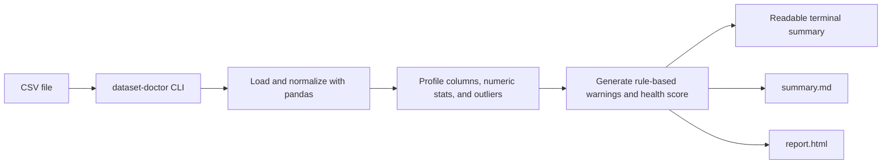

# Dataset Doctor

[](https://www.python.org/)
[](https://pandas.pydata.org/)
[](https://typer.tiangolo.com/)
[](https://jinja.palletsprojects.com/)
[](https://pytest.org/)
[](LICENSE)


Turn messy CSV files into an instant data health report.

Dataset Doctor is an open-source Python CLI for fast first-pass dataset checks. Point it at a CSV file and it will profile structure, missingness, duplicate rows, semantic column types, numeric distributions, outliers, uniqueness patterns, constant columns, and high-cardinality fields, then generate shareable Markdown and HTML reports.

## Why this project exists

Many CSV files look usable until hidden issues derail the workflow: sparse columns, accidental duplicates, ID-like fields masquerading as categories, suspicious numeric spikes, or columns that carry no information at all. Dataset Doctor is meant to surface those problems in seconds with a small command-line tool that still produces demo-friendly output.

The project supports both terminal inspection and generated artifacts for sharing:

- terminal summary
- `summary.md`
- `report.html`

## What the CLI checks today

- Row count and column count
- Column names
- Per-column missing count and missing percentage
- Duplicate row count and duplicate percentage
- Semantic column types: `numeric`, `boolean`, `datetime`, `categorical`
- Per-column unique count and unique ratio
- Constant columns
- High-cardinality string columns
- Numeric summaries: `min`, `max`, `mean`, `median`, `std`, `q1`, `q3`, `iqr`
- IQR-based outlier detection
- Rule-based warnings with `info`, `warning`, and `critical`
- Health score with badge: `Healthy`, `Needs Review`, `Critical`
- Automatic Markdown and HTML report generation

## 🛠️ Quickstart & Tutorial

### 1. Installation

First, clone the repository and set up a virtual environment:

```bash
git clone https://github.com/addaan1/dataset-doctor.git
cd dataset-doctor
python -m venv .venv
```

Activate the environment:
- **Windows**: `.venv\Scripts\activate`
- **macOS/Linux**: `source .venv/bin/activate`

Install the package in editable mode:
```bash
pip install -e .[dev]
```

### 2. Try the Demo

Dataset Doctor comes with a built-in demo dataset specifically crafted with missing values, duplicate rows, constant columns, and outliers. Run the tool against it:

```bash
dataset-doctor data/demo/quotes_to_scrape_doctor_demo.csv
```

### 3. View the Results

The command will immediately output a data health summary in your terminal. It will also generate beautifully formatted Markdown and HTML reports in your `outputs/` folder:

```text
outputs/
  quotes_to_scrape_doctor_demo/
    summary.md
    report.html
```

Open `outputs/quotes_to_scrape_doctor_demo/report.html` in any web browser to view the interactive dashboard!

### 4. Running on Your Own Data

It's just as easy to analyze your own datasets. Simply pass the path to your CSV file:

```bash
dataset-doctor path/to/your_data.csv
```

**Advanced Options:**
- Specify a custom separator or encoding:
  ```bash
  dataset-doctor path/to/your_data.csv --separator ";" --encoding "latin1"
  ```
- Print to terminal only (skip generating Markdown and HTML files):
  ```bash
  dataset-doctor path/to/your_data.csv --terminal-only
  ```
- Change the output directory:
  ```bash
  dataset-doctor path/to/your_data.csv --output-dir reports/
  ```

## Example terminal output

```text
Dataset Doctor
==============

Overview
  Source: quotes_to_scrape_doctor_demo.csv
  Rows: 11
  Columns: 7
  Duplicate rows: 1

Health Snapshot
  Score: 65/100 (Needs Review)
  High-missing columns (>30%): 1
  Constant columns: 1
  High-cardinality columns: 3
  Outlier columns: 1
  Suspicious columns: 5

Warnings
  - [CRITICAL] Column `tag_count` has 1 outliers (10.0%) using the IQR rule.
  - [WARNING] Dataset contains 1 duplicate rows (9.1% of all rows).
  - [WARNING] Column `primary_tag` has 4 missing values (36.4%).
```

## HTML preview

This is the visual direction of the generated `report.html`.


## Generated reports

- `summary.md` gives a concise text report with overview, score, top warnings, problematic columns, numeric findings, and suggested actions.
- `report.html` renders the same information in a beautiful, modern dashboard-like layout designed to be easier to scan and suitable for presentations.

The generated HTML uses a self-contained template, so the report can be opened directly in a browser without bundling extra assets.

## Demo data

The repository includes demo data under `data/`.

- `data/raw/quotes_to_scrape_page_1.csv` is based on page 1 of [Quotes to Scrape](https://quotes.toscrape.com/), a public practice site for scraping.
- `data/demo/quotes_to_scrape_doctor_demo.csv` is a derived demo dataset built from that scraped source and intentionally includes missing values, a duplicate row, a constant column, high-cardinality fields, and a numeric outlier so the report is visually informative.

More detail is documented in [data/README.md](data/README.md).

## How the current flow works



## Project layout

```text
data/
dataset_doctor/
  templates/
outputs/
tests/
```

## Contributing

Contributions are welcome! Please check the [CONTRIBUTING.md](CONTRIBUTING.md) guide and the open issues to get started. We use standard GitHub PR workflows.

## Changelog

See [CHANGELOG.md](CHANGELOG.md) for a history of changes and releases.

## License

This project is licensed under the MIT License.
