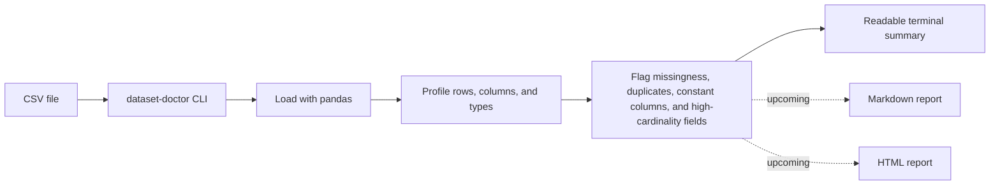

# Dataset Doctor

Turn messy CSV files into an instant data health report.

Dataset Doctor is an open-source Python CLI for fast first-pass dataset checks. Point it at a CSV file and it will profile the shape of the data, missingness, duplicate rows, semantic column types, uniqueness patterns, constant columns, and high-cardinality fields so you can see what deserves attention before deeper analysis.

## Why this project exists

Many CSV files look usable until a few hidden issues derail the workflow: columns full of nulls, duplicate rows, identifiers pretending to be categories, or fields that carry no information at all. Dataset Doctor is designed to make those problems visible in seconds with a simple command-line experience.

## Current milestone: Days 1-5

This repository currently focuses on the first five days of the roadmap:

- Project bootstrap with packaging and tests
- CSV loading through a Python CLI
- Dataset overview and terminal summary output
- Missing-value and duplicate-row checks
- Semantic column typing, uniqueness, constant-column, and high-cardinality detection

HTML and Markdown report generation are planned next and are not implemented yet in this milestone.

## What the CLI checks today

- Row count and column count
- Column names
- Per-column missing count and missing percentage
- Duplicate row count
- Semantic column types: `numeric`, `boolean`, `datetime`, `categorical`
- Per-column unique count and unique ratio
- Constant columns
- High-cardinality string columns
- A suspicious-columns summary for fast triage

## Quickstart

```bash
python -m venv .venv
.venv\Scripts\activate
pip install -e .[dev]
dataset-doctor examples/sample_dataset.csv
```

If you prefer module execution during development:

```bash
python -m dataset_doctor.cli examples/sample_dataset.csv
```

## Usage

```bash
dataset-doctor PATH_TO_FILE.csv --separator "," --encoding "utf-8"
```

## Example output

```text
Dataset Doctor
==============

Overview
  Source: sample_dataset.csv
  Rows: 10
  Columns: 10
  Duplicate rows: 1

Missingness (sorted)
  - email: 5 missing (50.0%) HIGH
  - notes: 5 missing (50.0%) HIGH
  - country: 2 missing (20.0%)
  - ticket_count: 1 missing (10.0%)

Duplicates
  - 1 duplicate rows detected (10.0% of the dataset)

Suspicious Columns
  - customer_id: high-cardinality strings
  - email: 50.0% missing; high-cardinality strings
  - name: high-cardinality strings
  - notes: 50.0% missing
  - source_system: constant values only
```

## How the current flow works



## Roadmap

### Days 6-10

- Add numeric summary statistics
- Add outlier detection
- Build automatic warning messages
- Generate Markdown and HTML reports
- Improve visual presentation for shareable outputs

### Days 11-14

- Expand test coverage and edge-case handling
- Strengthen the README with screenshots and demos
- Add open-source contribution polish
- Prepare the first public release

## Project layout

```text
dataset_doctor/
examples/
outputs/
tests/
```

## Contributing

Contributions are welcome. The current focus is on making the CLI profiler solid, testable, and easy to extend into richer report generation in the next milestone.

## License

This project is licensed under the MIT License.

