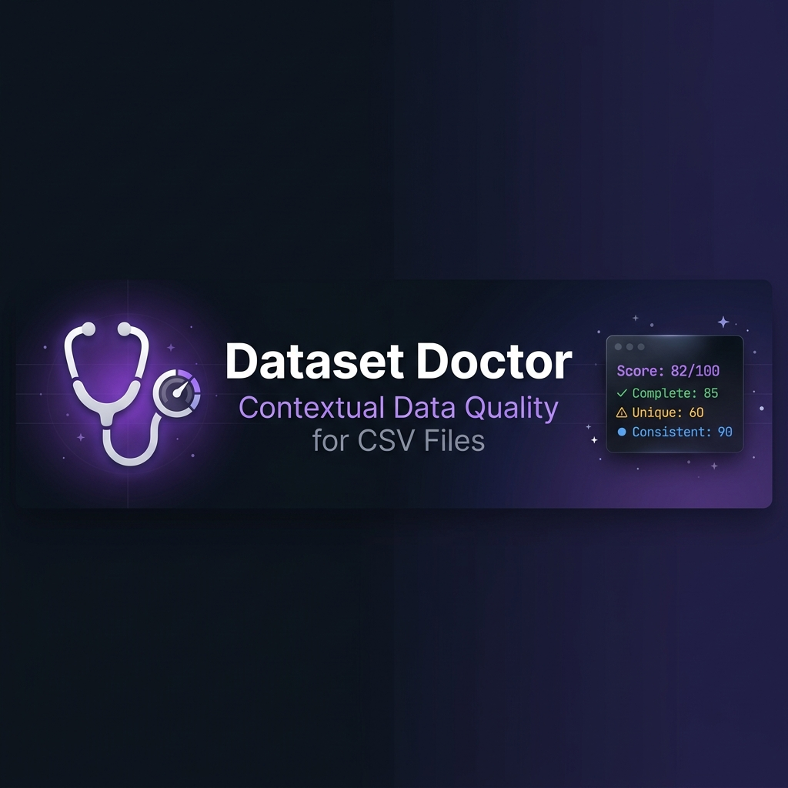
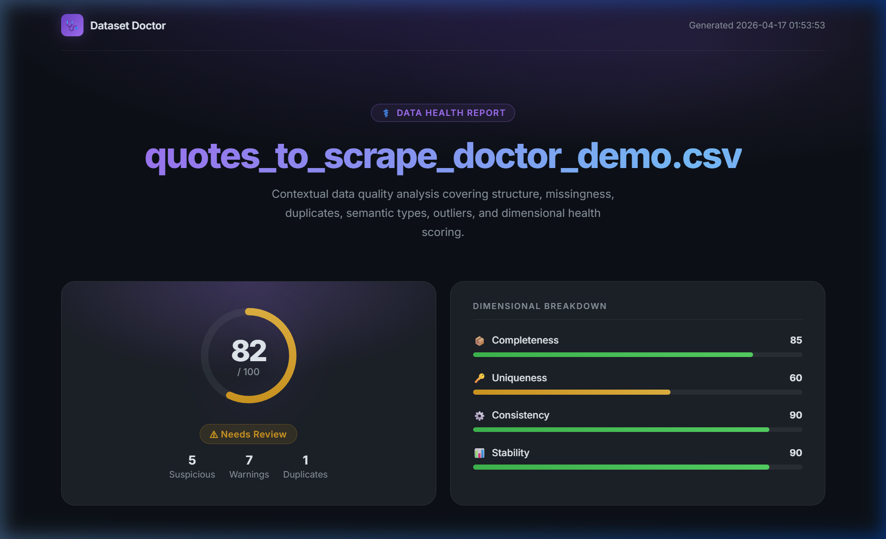
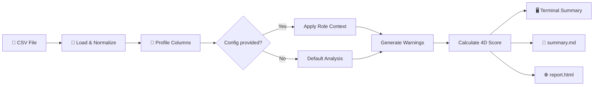

<div align="center">



# Dataset Doctor

**Contextual data quality analysis for CSV files. Point. Run. Ship.**

[](https://www.python.org/)
[](LICENSE)
[](https://github.com/addaan1/dataset-doctor/actions)
[](https://pandas.pydata.org/)
[](https://pytest.org/)

</div>

---

## What is Dataset Doctor?

Most CSV files look clean — until they aren't. **Dataset Doctor** is an open-source Python CLI that runs an instant contextual health check on any CSV file and produces:

- A **rich terminal summary** with a 4-dimensional score breakdown
- A **shareable Markdown report** (`summary.md`)
- A **beautiful dark-themed HTML dashboard** (`report.html`) with SVG score ring, progress bars, and warning cards

> Unlike simple profilers that apply the same rules to every column, Dataset Doctor **understands column context** — it knows an ID column *should* be unique, a financial column *may* have heavy tails, and a target column *cannot* be missing.

---

## ✨ Features at a Glance

|  | Feature | Details |
|--|---------|---------|
| 🩺 | **4-Dimensional Health Score** | Completeness · Uniqueness · Consistency · Stability |
| 🎯 | **Contextual Column Roles** | `id`, `target`, `timestamp`, `category`, `measure` via `config.json` |
| ⚠️ | **Smart Warnings** | Critical / Warning / Info levels with recommended actions |
| 🔍 | **Advanced Checks** | Mixed-type detection, parse failure rates, IQR outliers |
| 📊 | **HTML Dashboard** | Dark GitHub-inspired UI with SVG ring + animated progress bars |
| 📄 | **Markdown Summary** | Lightweight, shareable, CI-friendly text report |
| ⚡ | **Zero heavy deps** | Only Pandas, Typer, Jinja2 — no Spark, no Jupyter required |
| 🧪 | **Tested** | 19 behavior-based tests + GitHub Actions CI on every push |

---

## 🚀 Quickstart

### 1. Install

```bash
git clone https://github.com/addaan1/dataset-doctor.git
cd dataset-doctor

# Create & activate venv
python -m venv .venv
.venv\Scripts\activate        # Windows
# source .venv/bin/activate   # macOS / Linux

# Install
pip install -e .[dev]
```

### 2. Run on the built-in demo

```bash
dataset-doctor data/demo/quotes_to_scrape_doctor_demo.csv
```

### 3. Open your report

Reports land in `outputs/<filename>/`:

```
outputs/
  quotes_to_scrape_doctor_demo/
    summary.md      ← text report
    report.html     ← dark dashboard — open in any browser
```

---

## 🖥️ Terminal Output

Running Dataset Doctor prints a structured health snapshot directly to your terminal:

```text
Health Snapshot
  Score: 82/100 (Needs Review)
    - Completeness: 85/100
    - Uniqueness:   60/100
    - Consistency:  90/100
    - Stability:    90/100
  Suspicious columns: 5

Warnings
  - [CRITICAL] Column `tag_count` has 1 outliers (10.0%) using the IQR rule.
  - [WARNING]  Dataset contains 1 duplicate rows (9.1% of all rows).
  - [WARNING]  Column `primary_tag` has 4 missing values (36.4%).

Column Profile (Contextual)
  - primary_tag [feature]: categorical | missing 36.4% | flags: missing>=30%, high-cardinality
  - tag_count   [feature]: numeric     | missing  9.1% | flags: outliers
  - quote_id    [id]:      categorical | missing  0.0%  ← no false-positive warning!
```

---

## 🧠 Contextual Engine

The real power of Dataset Doctor is **context-awareness**. A plain profiler flags every high-cardinality column — but an ID column *should* be unique. A financial column *may* have a heavy tail. A target column *cannot* be missing.

Tell the doctor how to read your data with a simple `config.json`:

```json
{
    "global_missing_threshold": 40.0,
    "columns": {
        "customer_id": { "role": "id" },
        "revenue":     { "role": "measure", "allow_heavy_tail": true },
        "churn":       { "role": "target" }
    }
}
```

Then run with `--config`:

```bash
dataset-doctor sales.csv --config config.json
```

**What changes:**
- `customer_id` → high-cardinality warning suppressed ✅
- `revenue` → outlier warning suppressed ✅
- `churn` → missing values escalated to **Critical** ✅

---

## 🏥 HTML Report Preview

The generated `report.html` opens directly in any browser — no server, no extras.



**Dashboard sections:**
1. 🩺 **Hero** — file name, score ring, badge
2. 📐 **Dimensional bars** — Completeness / Uniqueness / Consistency / Stability
3. 📋 **Overview stats** — rows, columns, duplicates, outlier columns
4. ⚠️ **Warnings** — severity cards with recommended actions
5. 🗂️ **Structure summary** — semantic type distribution + suggested next steps
6. 🔍 **Problematic columns** — role-aware flag table
7. 📈 **Numeric findings** — descriptive stats + IQR bounds table

---

## 🛠️ All CLI Options

```bash
dataset-doctor <CSV_PATH> [OPTIONS]

Options:
  --config, -c    PATH    JSON config for column roles & overrides
  --separator, -s TEXT    CSV delimiter (default: ,)
  --encoding, -e  TEXT    File encoding (default: utf-8)
  --output-dir    PATH    Output folder (default: outputs/)
  --terminal-only         Skip file generation, print to terminal only
  --help                  Show this message and exit.
```

**Examples:**

```bash
# Semicolon-delimited file
dataset-doctor data.csv --separator ";"

# Provide column context
dataset-doctor data.csv --config config.json

# Quick inspection, no files written
dataset-doctor data.csv --terminal-only

# Custom output directory
dataset-doctor data.csv --output-dir reports/my_project
```

---

## 📐 How It Works



---

## 📁 Project Layout

```text
dataset-doctor/
├── dataset_doctor/
│   ├── analyzer.py      ← Column profiling & semantic type detection
│   ├── cli.py           ← Typer CLI entry point
│   ├── config.py        ← JSON config parser (DatasetConfig)
│   ├── models.py        ← DatasetProfile, ColumnProfile, HealthScore
│   ├── report.py        ← Score engine & report rendering
│   ├── warnings.py      ← Contextual warning generation
│   └── templates/
│       └── report.html.j2
├── data/
│   ├── demo/            ← Built-in demo dataset
│   └── raw/             ← Raw scraped source
├── tests/               ← 19 behavior-based pytest tests
├── .github/
│   └── workflows/
│       └── ci.yml       ← Auto lint + test on every push
├── CHANGELOG.md
├── CONTRIBUTING.md
└── pyproject.toml
```

---

## 🧪 Running Tests

```bash
# Activate venv first, then:
python -m pytest tests/ -v
```

All 19 tests are behavior-based — they assert on what the system *does*, not on exact text output, making them robust to UI changes.

---

## 🤝 Contributing

Contributions are welcome! Please read [CONTRIBUTING.md](CONTRIBUTING.md) first, then check the open [Issues](https://github.com/addaan1/dataset-doctor/issues) for things to work on.

We use standard GitHub PR workflows with `ruff` for linting and `pytest` for tests.

---

## 📦 Changelog

See [CHANGELOG.md](CHANGELOG.md) for a full history of changes and releases.

---

## 📄 License

This project is licensed under the [MIT License](LICENSE).

---

<div align="center">

Built with ❤️ for data practitioners who want fast, honest feedback on their datasets.

**[⭐ Star on GitHub](https://github.com/addaan1/dataset-doctor)** if Dataset Doctor saves you time!

</div>
